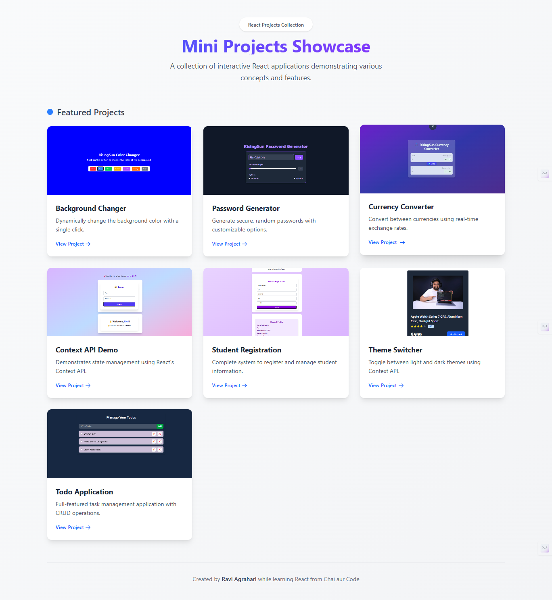
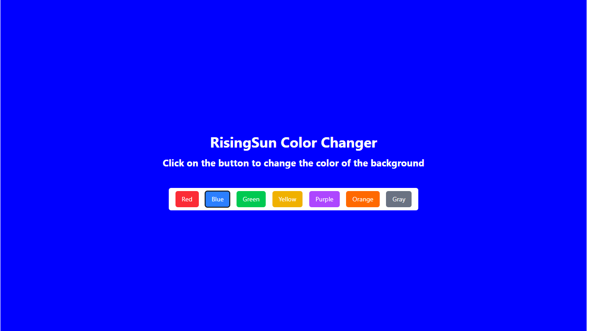
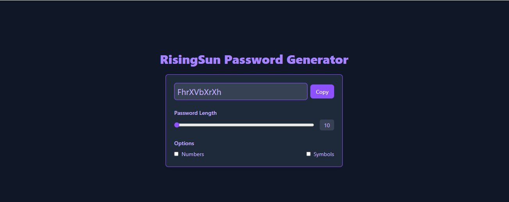
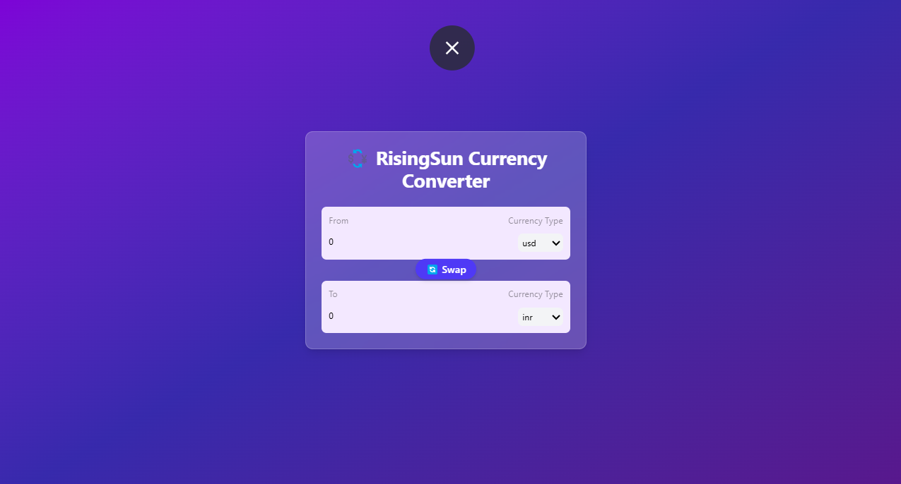
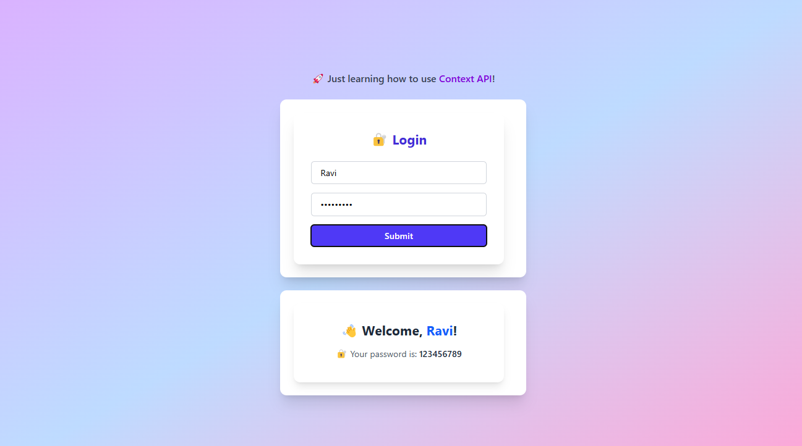
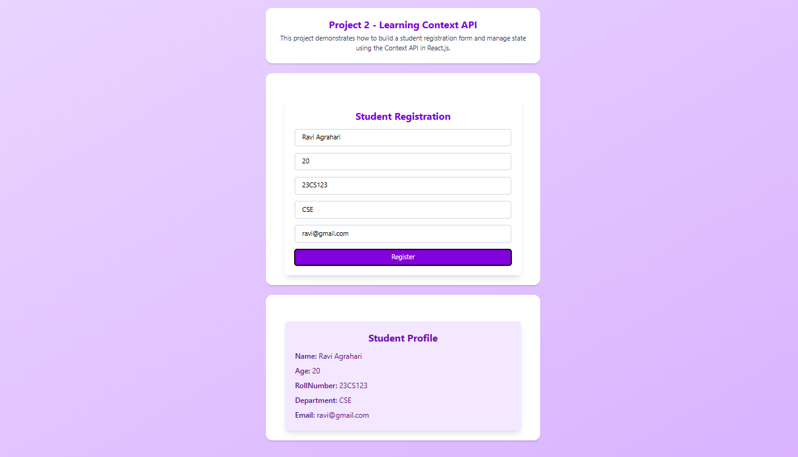
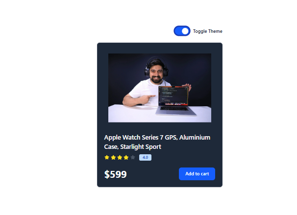
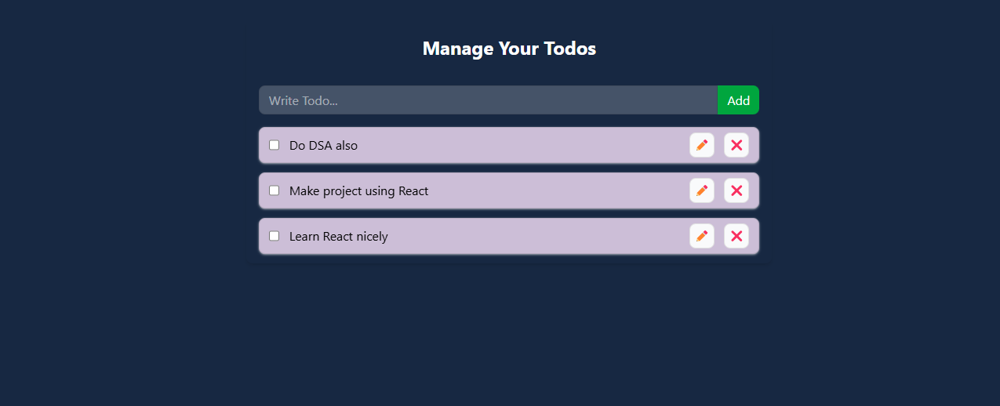

# 🚀 React Mini Projects Showcase

Welcome to the **RisingSun's React Mini Projects Hub** — a curated collection of beginner-to-intermediate level React.js projects I built while learning from the amazing [Chai aur Code](https://www.youtube.com/@chaiaurcode) course! ❤️

These projects cover various core concepts like state management, hooks, Context API, conditional rendering, and component design using Tailwind CSS.

---

## 📸 Project Preview



> _“Practice makes progress.”_ – This collection reflects my journey of learning React.js one small project at a time.

---

## 📁 Included Projects

---

### 🎨 Background Changer



Change the background color randomly with a single click. A fun intro project using state and event handling in React.

---

### 🔐 Password Generator



Generate secure, random passwords with customizable options like length, symbols, and numbers using checkboxes and React state.

---

### 💱 Currency Converter



Convert between different currencies using real-time exchange rates from an API. Demonstrates API calls and dynamic UI updates.

---

### ⚛️ Mini Context Demo



A simple demonstration of the React Context API for managing global state between components like Login and Profile.

---

### 🧑‍🎓 Student Registration



A basic form to register students with validation. Learnings include controlled components, context sharing, and input management.

---

### 🌗 Theme Switcher



Toggle between light and dark themes using React Context and Tailwind CSS for a sleek, responsive UI.

---

### ✅ Todo Application



A full-featured task manager with add, edit, delete, and complete functionality. Covers React hooks, conditional rendering, and UI best practices.

---

## 🛠️ Built With

- **React.js**
- **React Router DOM**
- **Tailwind CSS**
- **Custom Hooks**
- **Context API**
- **Vite** (Optional, if used)

---

## 📂 Folder Structure

```
MiniProjectsHub/
├── public/
├── src/
│   ├── Mini_Projects/
│   │   ├── BgChanger/
│   │   ├── PasswordGenerator/
│   │   ├── CurrencyConvertor/
│   │   ├── ContextApiProjects/
│   │   ├── TodoApp/
│   ├── images/
│   ├── App.jsx
│   ├── ProjectCard.jsx
│   └── main.jsx
├── tailwind.config.js
└── package.json
```

---

## ▶️ How to Run Locally

```bash
# 1. Clone the repo
git clone https://github.com/yourusername/react-mini-projects-hub.git

# 2. Navigate into the folder
cd react-mini-projects-hub

# 3. Install dependencies
npm install

# 4. Start the development server
npm run dev
```

Then open `http://localhost:5173/` in your browser.

---

## 🧠 What I Learned

- Routing with `react-router-dom`
- Shared state using Context API
- Custom React Hooks
- Tailwind CSS styling techniques
- Component reusability and clean folder structuring

---

## 📬 Connect With Me

If you liked this project or found it helpful, connect with me on:

- 💼 [LinkedIn](https://www.linkedin.com/in/ravi-agrahari-9a653027a/))


---

## 📄 License

This project is open source and available under the [MIT License](LICENSE).

---
